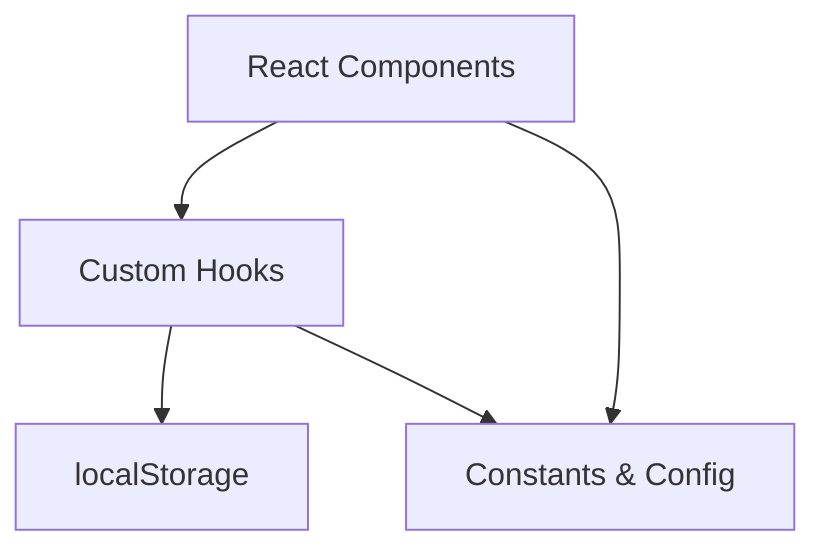

# Caliper Flow Architecture

## Overview

Caliper Flow is a React-based web application designed for production workflow management. It follows a modular architecture separating UI components, business logic (hooks), and global constants.

## Data Flow

### Components
- **Container Components**: `App.jsx`, `ProcessList.jsx`, `Dashboard.jsx` - manage high-level orchestration.
- **Presentational Components**: `StatCard`, `JobCard`, `ProcessModals` - focused on UI and local interactions.

### Logic (Hooks)
- `useJobs`: Centralizes all job-related CRUD and status update logic.
- `useStaff`: Manages staff list and preferences.
- `useLocalStorage`: Low-level wrapper for data persistence.

### State Persistence
All critical data is persisted in `localStorage` to ensure work is not lost upon page refresh. Keys are defined in `constants.js`.
